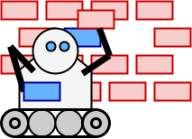

Upgrobot
========

A tool to run a script inside Git repository and produce a Pull Request (PR) based on the change. Originally designed for keeping the dependencies of the repository up to date.

Shipped as Container, but the scripts can be run in other CI tooling also.

Design
------

The tool is a set of scripts that each does one of the steps

1. Pull the Git repository for evaluation
2. Fetch the external dependencies and do the change to the repository
3. Evaluate the change against the repository
4. If the change is not in the upstream Git server, propose the change as a PR to the server

The practice is to run the following scripts from this package: #1, #3, #4. The #2 that does the change is usually inside the target repository. The provided script name will be searched from the target repository first, and then from the default installation path. A full path pointing to the script will work also.

The tool is designed to be scheduled as a standalone job in cron like fashion. Bots usually seem to act on Webhooks, but Webhooks are not useful for polling external resources. However, Webhooks could be used for registering the repository to the internal databases. Originally, the tool was a container image that will run all the steps. However, the scripts #2--#4 can be run in CI / pipeline engine, if there is support for scheduled jobs.

Alternative approach is that we pull only the file that needs changes, do the specific one line change using regexp replace, and pull the repository and create the PR only if there is a change. 

Usage
-----

Parameters can be provided either as Environment variables or as command line arguments.

The command line help

    usage: ../src/upgrobot.sh parameters [-h]
    
    Runs an update script in a target repository and creates a PR
    The parameters can be passed as environment variables also. See the variable names below.
    
    The mandatory parameters
    -r UPGROBOT_GIT_URL    The target repository HTTP URL to pull. Currently supports only HTTP URLs.
    -u UPGROBOT_GIT_USER   The username to authenticate to the git server.
    -p UPGROBOT_GIT_PASS   The password to authenticate to the git server. Prefer using environment variable here.
    -b UPGROBOT_GIT_BRANCH The git branch to target.
    -e UPGROBOT_GIT_EMAIL  The email address in the commit message. The commit username is auth username.
    -t UPGROBOT_LEADING_TITLE The title that is prepended to PR. Will be used to search for the old PR.
    -U UPGROBOT_UPDATE_SCRIPT The update script, either path or name that will be searched in from the default path.
    -P UPGROBOT_PR_SCRIPT  The script that is used for PR, either path or name that will be searched from the default path.
    
    The optional parameters
    -D UPGROBOT_SCRIPT_DIR The directory to look for the scripts. First searches exact match from the target repository and then this directory. Current value '/bin/path'.
    -D UPGROBOT_CLONE_DIR  The directory where to clone the repository. Supports existing directory, but not well tested. Current value '/tmp/clonepath'.
    -m UPGROBOT_GENERIC_MSG The message to add to the commit messages and similar to indicate the automatic change. Some variables are templated in this message. Current value 'The change was generated by script %UPGROBOT_UPDATE_SCRIPT%'.
    -B UPGROBOT_PR_BRANCH_PREFIX  The prefix of the temporary branch that is used for PR. Current value 'upgrobot-'.
    -h Prints this help text

Docker / Container usage 

    docker run --name upgrobot \
      -e UPGROBOT_GIT_URL=https://git.example.com/my/git \
      -e UPGROBOT_GIT_USER=exampleuser \
      -e UPGROBOT_GIT_PASS=examplepass \
      -e UPGROBOT_GIT_BRANCH=main \
      -e UPGROBOT_GIT_EMAIL=example@example.org \
      -e UPGROBOT_LEADING_TITLE="Super change" \
      -e UPGROBOT_UPDATE_SCRIPT=update/update.sh \
      -e UPGROBOT_PR_SCRIPT=pr/gitea.sh \
      upgrobot:latest

The script inside the container can be also run in a polling loop like this

    docker run --name upgrobot \
      ...
      env vars
      ...
      --restart=always \
      upgrobot:latest /bin/sh -c "while sleep 3600; do date; /app/upgrobot.sh; done"

Details
-------

Each step is a script. The scripts take the parameters as environment variables. The return value should be non zero only in error cases.

### Step 1: Pull the repository

The step will pull the target repository and branch using the provided credentials.

Supports only HTTP repository paths currently.

### Step 2: Do the changes

The step runs a script that is usually homed in the target repository. 

The possible parameters to the script should be provided as configuration files or environment variables. The script will be run on the repository root. The same external state should always produce the same change. 

The script must output the following

    $descriptive_title

    $commit_message_input

    $instructions

where `$descriptive_title` is could be used for commit title and it appended to the PR title name, `$commit_message_input` can be used as input for commit message and optional `$instructions` are instructions for humans how to process the change. The variables above are used in the PR step below.

`$descriptive_title` should be different for each distinct commit.

Output example

    Alpine image updated to 3.16.0

    Alpine image in Dockerfile update to 3.16.0.

    Ensure that the software is rebuilt and tested with the new image.

### Step 3: Evaluate the changes 

The step checks if any changes happened compared to the original state.

### Step 4: Create a PR

The script is run in target repository root..

It need to implement following steps

- check if the PR exists
- create a branch
- commit the change
- delete old the PR if it is outdated
- create the PR

The step need to be idempotent, so the same change would produce always the same PR. The title of PR is usually used to check if the PR is already created. So `$descriptive_title` should change when the commit content changes.

PR message will be produced like this

    $UPGROBOT_LEADING_TITLE: $descriptive_title

    $commit_message_input

    The change was generated by script $UPGROBOT_UPDATE_SCRIPT.

    $instructions

where `$UPGROBOT_LEADING_TITLE` is the title that is prepended to PR title. `$descriptive_title`, `$commit_message_input` and `$instructions` are output of the change script, and `$UPGROBOT_UPDATE_SCRIPT` is the script name.

Development
-----------

See development requirements in `requirements`.

Build

    podman build --timestamp 0 -t upgrobot:latest .
    skopeo copy containers-storage:localhost/upgrobot:latest docker-daemon:upgrobot:latest

To run tests

    sh tests/run.sh

If you need to keep gitea running, interrupt the test run before finishing.

Cleanup

    podman rmi upgrobot:latest
    podman play kube tests/test-deployment.yaml --down
    docker rmi upgrobot:latest

TODO

- Flow diagram that shows relationship between the steps
- Reproducible build and store spdx files in the repository
  - for generating the spdx, use anchore syft
- Pipeline + releases
  - podman build
  - test
  - update spdx (syft)
  - release (check that mathces spdx here) (push to gitea etc. releases)
- Keep README examples up to date
- Pipeline to multiple targets using a generic script (Makefile, Actions, Woodpecker)
- Convention to automatically create upgrobot instances for the repository, eg. search for scripts/update-dockerfile.sh
- upgrobot to keep this repository dependencies (Dockerfile) up to date
